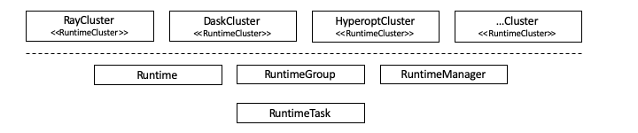
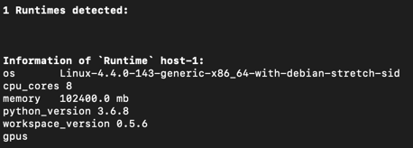
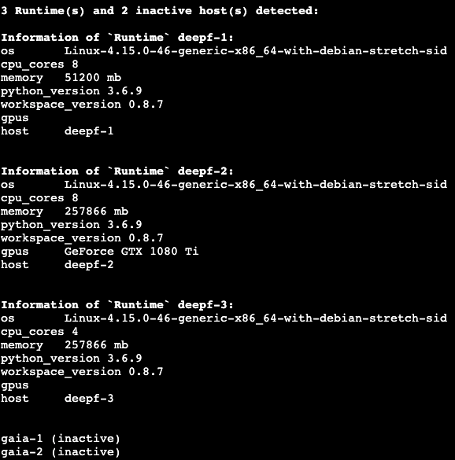
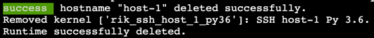

<h1 align="center">
    🎛 lazycluster
    <br>
</h1>

<p align="center">
    <strong>Distributed machine learning made simple.</strong><br/>
    Use your preferred distributed ML framework like a <a href="https://youtu.be/UXSSJENiZiw">lazy engineer</a>.
</p>

<p align="center">
    <a href="https://github.com/ml-tooling/lazycluster/blob/master/LICENSE" title="ML Hub License"></a>
    <a href="https://gitter.im/ml-tooling/lazycluster" title="Chat on Gitter"></a>
    <a href="https://twitter.com/mltooling" title="ML Tooling on Twitter"></a>
    <a href="3" title="Lazycluster Test Pipeline"></a>
</p>

<p align="center">
  <a href="#getting-started">Getting Started</a> •
  <a href="#highlights">Highlights</a> •
  <a href="#features">Features</a> •
  <a href="./docs">API Docs</a> •
  <a href="#support">Support</a> •
  <a href="https://github.com/ml-tooling/ml-workspace/issues/new?labels=bug&template=01_bug-report.md">Report a Bug</a> •
  <a href="#contribution">Contribution</a>
</p>

**lazycluster** is a Python library intended to liberate data scientists and machine learning engineers by abstracting
away cluster management and configuration so that they are able to focus on their actual tasks. Especially, the easy
and convenient cluster setup with Python for various distributed machine learning frameworks is emphasized.

## Highlights

- **High-Level API for starting clusters:**
  - [DASK](https://distributed.dask.org/en/latest/)
  - [Hyperopt](https://github.com/hyperopt/hyperopt)
  - *More *lazyclusters* (e.g. Ray, PyTorch, Tensorflow, Horovod, Spark) to come ...*
- **Lower-level API for:**
  - Managing [Runtimes](./docs/runtimes.md#runtime-class) or [RuntimeGroups](./docs/runtime_mgmt.md#runtimegroup-class) to:
    - A-/synchronously execute [RuntimeTasks](./docs/runtimes.md#runtimetask-class) by leveraging the power of ssh
    - Expose services (e.g. a DB) from or to a `Runtime` or in a whole `RuntimeGroup`
- **Command line interface (CLI)**
  - List all available `Runtimes`
  - Add a `Runtime` configuration
  - Delete a `Runtime` configuration

<br/>



> **Concept Definition:** _[Runtime](./docs/runtimes.md#runtime-class)_ <a name="runtime"></a>
>
> A `Runtime` is the logical representation of a remote host. Typically, the host is another server or a virtual machine / container on another server. This python class provides several methods for utilizing remote resources such as the port exposure from / to a `Runtime` as well as the execution of [RuntimeTasks](#task). A `Runtime` has a working directory. Usually, the execution of a `RuntimeTask` is conducted relatively to this directory if no other path is explicitly given. The working directory can be manually set during the initialization. Otherwise, a temporary directory gets created that might eventually be removed.

> **Concept Definition:** _[RuntimeGroup](./docs/runtimes.md#runtimetask-class)_
>
> A `RuntimeGroup` is the representation of logically related `Runtimes` and provides convenient methods for managing those related `Runtimes`. Most methods are wrappers around their counterparts in the `Runtime` class. Typical usage examples are exposing a port (i.e. a service such as a DB) in the `RuntimeGroup`, transfer files, or execute a `RuntimeTask` on the `Runtimes`. Additionally, all concrete [RuntimeCluster](./docs/cluster.runtime_cluster.md#runtimecluster-class) (e.g. the [HyperoptCluster](./docs/cluster.hyperopt_cluster.md#hyperoptcluster-class)) implementations rely on `RuntimeGroups` for example.

> **Concept Definition:** _Manager_<a name="manager"></a>
>
> The `manager` refers to the host where you are actually using the lazycluster library, since all desired lazycluster entities are managed from here. **Caution**: It is not to be confused with the [RuntimeManager](./docs/runtime_mgmt.md#runtimemanager-class) class.

> **Concept Definition:** _[RuntimeTask](./docs/runtimes.md#runtimetask-class)_ <a name="task"></a>
>
> A `RuntimeTask` is a composition of multiple elemantary task steps, namely `send file`, `get file`, `run command` (shell), `run function` (python). A `RuntimeTask` can be executed on a remote host either by handing it over to a `Runtime` object or standalone by handing over a [fabric Connection](http://docs.fabfile.org/en/2.5/api/connection.html) object to the execute method of the `RuntimeTask`. Consequently, all invididual task steps are executed sequentially. Moreover, a `RuntimeTask` object captures the output (stdout/stderr) of the remote execution in its execution log. An example for a `RuntimeTask` could be to send a csv file to a `Runtime`, execute a python function that is transforming the csv file and finally get the file back.

---

<br>

## Getting started

### Installation

```bash
pip install lazycluster
```

```bash
# Most up-to-date development version
pip install --upgrade git+https://github.com/ml-tooling/lazycluster.git@develop
```

### Prerequisites

**For lazycluster usage on the [manager](#manager):**

- Unix based OS
- Python >= 3.6
- ssh client (e.g. openssh-client)
- Passwordless ssh access to the `Runtime` hosts **(recommended)**
  <a name="passwordless-ssh"></a>
  <details>
  <summary>Configure passwordless ssh access (click to expand...)</summary>

  - Create a key pair on the manager as described [here](https://www.ssh.com/ssh/keygen#creating-an-ssh-key-pair-for-user-authentication) or use an existing one
  - [Install](#installation) lazycluster on the manager
  - Create the ssh configuration for each host to be used as Runtime by using the lazycluster CLI command `lazycluster add-runtime` as described [here](#add-host-to-ssh-config) and **do not forget** to specify the `--id-file` argument.
  - Finally, enable the passwordless ssh access by copying the public key to each Runtime as descibed [here](https://www.ssh.com/ssh/keygen#copying-the-public-key-to-the-server)
  </details>
  <br/>

**[Runtime](#runtime) host requirements:**

- Unix based OS
- Python >= 3.6
- ssh server (e.g. openssh-server)

**Note:**

Passwordless ssh needs to be setup for the hosts to be used as [Runtimes](./docs/runtimes.md#runtime-class) for the most convenient user experience. Otherwise, you need to pass the connection details to Runtime.\_\_init\_\_ via connection_kwargs. These parameters will be passed on to the [fabric.Connection](http://docs.fabfile.org/en/2.4/api/connection.html#connect-kwargs-arg).

### Usage example high-level API

Start a [Dask](https://distributed.dask.org/en/latest/) cluster.

```python
from lazycluster import RuntimeManager
from lazycluster.cluster.dask_cluster import DaskCluster

# Automatically generate a group based on the ssh configuration
runtime_manager = RuntimeManager()
runtime_group = runtime_manager.create_group()

# Start the Dask cluster instances using the RuntimeGroup
dask_cluster = DaskCluster(runtime_group)
dask_cluster.start()

# => Now, you can start using the running Dask cluster

# Get Dask client to interact with the cluster
# Note: This will give you a dask.distributed.Client which is not
#       a lazycluster cluster but a Dask one instead
client = cluster.get_client()
```

### Usage example lower-level API

Execute a Python function on a remote host and access the return data.

```python
from lazycluster import RuntimeTask, Runtime

# Define a Python function which will be executed remotely
def hello(name:str):
    return 'Hello ' + name + '!'

# Compose a `RuntimeTask`
task = RuntimeTask('my-first_task').run_command('echo Hello World!') \
                                   .run_function(hello, name='World')

# Actually execute it remotely in a `Runtime`
task = Runtime('host-1').execute_task(task, execute_async=False)

# The stdout from from the executing `Runtime` can be accessed
# via the execution log of the `RuntimeTask`
task.print_log()

# Print the return of the `hello()` call
generator = task.function_returns
print(next(generator))
```

---

## Support

The **lazycluster** project is maintained by [Jan Kalkan](https://www.linkedin.com/in/jan-kalkan-b5390284/). Please
understand that we won't be able to provide individual support via email. We also believe that help is much more
valuable if it's shared publicly so that more people can benefit from it.

| Type                     | Channel                                                                                                                                                                                                                                                                                                                                |
| ------------------------ | -------------------------------------------------------------------------------------------------------------------------------------------------------------------------------------------------------------------------------------------------------------------------------------------------------------------------------------- |
| 🚨 **Bug Reports**       | <a href="https://github.com/ml-tooling/lazycluster/issues?utf8=%E2%9C%93&q=is%3Aopen+is%3Aissue+label%3Abug+sort%3Areactions-%2B1-desc+" title="Open Bug Report"></a>                                                                                   |
| 🎁 **Feature Requests**  | <a href="https://github.com/ml-tooling/lazycluster/issues?q=is%3Aopen+is%3Aissue+label%3Afeature-request+sort%3Areactions-%2B1-desc" title="Open Feature Request"></a>                                             |
| 👩‍💻 **Usage Questions**   | <a href="https://stackoverflow.com/questions/tagged/ml-tooling" title="Open Question on Stackoverflow"></a> <a href="https://gitter.im/ml-tooling/lazycluster" title="Chat on Gitter"></a> |
| 🗯 **General Discussion** | <a href="https://gitter.im/ml-tooling/lazycluster" title="Chat on Gitter"></a> <a href="https://twitter.com/mltooling" title="ML Tooling on Twitter"></a>                                   |

---

## Features

### Use the Command Line Interface (`CLI`) to manage local ssh configuration to enable `Runtime` usage

<details>
<summary><b>Details</b> (click to expand...)</summary>

For a full list of CLI commands please use `lazycluster --help`. For the help of a specific command please use `lazycluster COMMAND --help`.

#### List all available runtimes incl. additional information like cpu, memory, etc.

Moreover, also incative hosts will be shown. Inactive means, that the host could not be reached via ssh and instantiated as a valid Runtime.

```bash
# Will print a short list of active / inactive Runtimes
lazycluster list-runtimes
```



```bash
# will print a list of active / inactive Runtimes incl. additional host information
# Note: This is slower as compared to omittin the -l option
lazycluster list-runtimes -l
```



#### Add host to ssh config

The host is named `localhost` for user `root` accessible on `localhost` port `22` using the private key file found under
~/.ssh/id_rsa.

**Note:** Add command will only add the ssh configuration on the [manager](#manager). For a complete guide on how to setup passwordless ssh check the [prerequisites section](#passwordless-ssh).

```bash
lazycluster add-runtime localhost root@localhost:22 --id_file ~/.ssh/id_rsa
```


#### Delete the ssh config of `Runtime`

_Note:_ Corresponding remote ikernel will be deleted too if present.

```bash
lazycluster delete-runtime host-1
```



</details>

### Create `Runtimes` & `RuntimeGroups`

<details>
<summary><b>Details</b> (click to expand...)</summary>

A `Runtime` has a working directory. Usually, the execution of a [RuntimeTask](#task) is conducted relatively to this directory if no other path is explicitly given. The working directory can be manually set during the initialization. Otherwise, a temporary directory gets created that might eventually be removed.

```python
from lazycluster import Runtime, RuntimeGroup

rt_1 = Runtime('host-1')
rt_2 = Runtime('host-2', working_dir='/workspace')

# In this case you get a group where both Runtimes have different working directories.
# The working directory on host-1 will be a temp one and gets removed eventually.
runtime_group = RuntimeGroup([rt_1, rt_2])

# Here, the group internally creates Runtimes for both hosts and sets its working directory.
runtime_group = RuntimeGroup(hosts=['host-1', 'host-2'], working_dir='/workspace')
```

Moreover, you can set environment variables for the Runtimes. These variables can then be accessed when executing a Python function on the Runtime or executing a shell command. Per default the working directory is set as an env variable and the class constant `Runtime.WORKING_DIR_ENV_VAR_NAME` will give you the name of the variable. The working directory is always accessible also if manually update the env_variables.

```python
# Directly set the env vars per Runtimes
rt = Runtime('host-1')
rt.env_variables = {'foo': 'bar'}

# Or use the convenient method to the the env vars
# for all Runtimes in a RuntimeGroup
runtime_group = RuntimeGroup(hosts=['host-1', 'host-2'])
group.set_env_variables({'foo': 'bar'})
```

</details>

### Use the `RuntimeManager` to create a `RuntimeGroup` based on the manager's ssh config

<details>
<summary><b>Details</b> (click to expand...)</summary>

The [RuntimeManager](./docs/runtime_mgmt.md#runtimemanager-class) can automatically detect all available [Runtimes](./docs/runtimes.md#runtime-class) based on the [manager's](#manager) local ssh config and eventually create a necessary [RuntimeGroup](./docs/runtime_mgmt.md#runtimegroup-class) for you.

```python
from lazycluster import RuntimeManager, RuntimeGroup

runtime_group = RuntimeManager().create_group()
```

</details>

### Start a [Dask](https://dask.org/) cluster for scalable analytics

<details>
<summary><b>Details</b> (click to expand...)</summary>

Most simple way to use Dask in a cluster based on a [RuntimeGroup](./docs/runtime_mgmt.md#runtimegroup-class) created by the [RuntimeManager](./docs/runtime_mgmt.md#runtimemanager-class). The `RuntimeManager` can automatically detect all available [Runtimes](./docs/runtimes.md#runtime-class) based on the [manager's](#manager) ssh config and eventually create a necessary `RuntimeGroup` for you. This `RuntimeGroup` is then handed over to [DaskCluster](./docs/cluster.dask_cluster.md#daskcluster-class) during initialization.

The DASK `scheduler` instance gets started on the [manager](#manager). Additionally, multiple DASK `worker` processes get started in the `RuntimeGroup`, i.e. in the `Runtimes`. The default number of workers is equal to the number of `Runtimes` in the `RuntimeGroup`.

**Prerequisite**:
Please make sure that you have Dask installed on the [manager](#manager). This can be done using `pip install -q "dask[complete]"`.

<details>
<summary><b>Details</b> (click to expand...)</summary>

```python
from lazycluster import RuntimeManager
from lazycluster.cluster.dask_cluster import DaskCluster

# 1st: Create a RuntimeGroup, e.g. by letting the RuntimeManager detect
#      available hosts (i.e. Runtimes) and create the group for you.
runtime_group = RuntimeManager().create_group()

# 2nd: Create the DaskCluster instance with the RuntimeGroup.
cluster = DaskCluster(runtime_group)

# 3rd: Let the DaskCluster instantiate all entities on Runtimes
#      of the RuntimeGroup using default values. For custom
#      configuration check the DaskCluster API documentation.
cluster.start()

# => Now, all cluster entities should be started and you can simply use
#    it as documented in the hyperopt documentation.
```

Test the cluster setup

```python
# Define test functions to be executed in parallel via DASK
def square(x):
    return x ** 2

def neg(x):
    return -x

# Get a DASK client instance
client = cluster.get_client()

# Execute the computation
A = client.map(square, range(10))
B = client.map(neg, A)
total = client.submit(sum, B, )
res = total.result()

print('Result: ' + str(res))
```

</details>
<br/>
Use different strategies for launching the master and the worker instances.
 
<details>
<summary><b>Details</b> (click to expand...)</summary>

Use different strategies for launching the master and the worker instance by providing custom implementation of `lazycluster.cluster.MasterLauncher` and `lazycluster.cluster.WorkerLauncher`. The default implementations are `lazycluster.cluster.dask_cluster.LocalMasterLauncher` and `lazycluster.cluster.dask_cluster.RoundRobinLauncher`.

```python
cluster = DaskCluster(RuntimeManager().create_group(),
                      MyMasterLauncherImpl(),
                      MyWorkerLauncherImpl())
cluster.start()
```

</details>
</details>

### Distributed hyperparameter tuning with [Hyperopt](https://github.com/hyperopt/hyperopt/wiki/Parallelizing-Evaluations-During-Search-via-MongoDB)

<details>
<summary><b>Details</b> (click to expand...)</summary>

Most simple way to use Hyperopt in a cluster based on a [RuntimeGroup](./docs/runtime_mgmt.md#runtimegroup-class) created by the [RuntimeManager](./docs/runtime_mgmt.md#runtimemanager-class). The `RuntimeManager` can automatically detect all available [Runtimes](./docs/runtimes.md#runtime-class) based on the [manager's](#manager) ssh config and eventually create a necessary `RuntimeGroup` for you. This `RuntimeGroup` is then handed over to [HyperoptCluster](./docs/cluster.hyperopt_cluster.md#hyperoptcluster-class) during initialization.

A MongoDB instance gets started on the [manager](#manager). Additionally, multiple hyperopt `worker` processes get started in the `RuntimeGroup`, i.e. on the contained `Runtimes`. The default number of workers is equal to the number of `Runtimes` in the `RuntimeGroup`.

**Prerequisites:**

- [MongoDB](https://docs.mongodb.com/manual/administration/install-on-linux/) server must be installed on the [manager](#manager).
  - **Note:** When using the [ml-workspace](https://github.com/ml-tooling/ml-workspace) as the `master` then you can use the provided install script for MongoDB which can be found under `/resources/tools`.
- [Hyperopt must be installed ](https://github.com/hyperopt/hyperopt) on all `Runtimes` where hyperopt workers will be started
  - **Note:** When using the [ml-workspace](https://github.com/ml-tooling/ml-workspace) as hosts for the `Runtimes` then hyperopt is already pre-installed.

<details>
<summary><b>Launch a cluster</b> (click to expand...)</summary>

For a detailed documentation of customizing options and default values check out the [API docs](./docs/cluster.hyperopt_cluster.md#hyperoptcluster-class)

```python
from lazycluster import RuntimeManager
from lazycluster.cluster.hyperopt_cluster import HyperoptCluster

# 1st: Create a RuntimeGroup, e.g. by letting the RuntimeManager detect
#      available hosts (i.e. Runtimes) and create the group for you.
runtime_group = RuntimeManager().create_group()

# 2nd: Create the HyperoptCluster instance with the RuntimeGroup.
cluster = HyperoptCluster(runtime_group)

# 3rd: Let the HyperoptCluster instantiate all entities on Runtimes of the RuntimeGroup using default values. For custom
#      configuration check the HyperoptCluster API documentation.
cluster.start()

# => Now, all cluster entities should be started and you can simply use
#    it as documented in the hyperopt documentation. We recommend to call
#    cluster.cleanup() once you are done.

```

Test the cluster setup using the simple [example](https://github.com/hyperopt/hyperopt/wiki/Parallelizing-Evaluations-During-Search-via-MongoDB) to minimize the sin function.

**Note:** The call to `fmin` is also done on the [manager](#manager). The `objective_function` gets sent to the hyperopt workers by fmin via MongoDB. So there is no need to trigger the execution of `fmin` or the `objective_function` on the individual `Runtimes`. See [hyperopt docs](https://github.com/hyperopt/hyperopt/wiki/Parallelizing-Evaluations-During-Search-via-MongoDB) for detailed explanation.

```python
import math
from hyperopt import fmin, tpe, hp
from hyperopt.mongoexp import MongoTrials

# You can retrieve the the actual url required by MongoTrials form the cluster instance
trials = MongoTrials(cluster.mongo_trial_url, exp_key='exp1')
objective_function = math.sin
best = fmin(objective_function, hp.uniform('x', -2, 2), trials=trials, algo=tpe.suggest, max_evals=10)
# Ensures that MongoDB gets stopped and other resources
cluster.cleanup()
```

Now, we will cenceptually demonstrate how to use `lazycluster` w/ hyperopt to optimize hyperparameters of a [fasttext](https://github.com/facebookresearch/fastText) model. Note, this should not be a fasttext demo and thus the actual usage of fasttext is not optimized. Thus, you should read the related docs for this purpose. The example should just highlight how to get fasttext up and running in a distributed setting using lazycluster.

```python
from lazycluster import RuntimeManager
from lazycluster.cluster.hyperopt_cluster import HyperoptCluster
import os

# 1st: Create a RuntimeGroup, e.g. by letting the RuntimeManager detect
#      available hosts (i.e. Runtimes) and create the group with a persistent
#      working directory for you.
runtime_group = RuntimeManager().create_group(working_dir='~/hyperopt')

# 2nd: Send the training - and test dataset to all Runtimes
path_to_datasets = '/path_on_manager'
train_file_name = 'train.csv'
train_path = os.path.join(path_to_datasets, train_file_name)
test_file_name = 'train.csv'
test_path = os.path.join(path_to_datasets, test_file_name)

# Per default the file will be send asynchronously to Runtime's working directory
runtime_group.send_file(train_file_name)
runtime_group.send_file(test_file_name)

# 3rd: Create the HyperoptCluster instance with the RuntimeGroup.
cluster = HyperoptCluster(runtime_group)

# 4th: Let the HyperoptCluster instantiate all entities on
# Runtimes of the RuntimeGroup using default values.
# For custom  configuration check the HyperoptCluster API documentation.
cluster.start()

# 5th: Ensure that the processes for sending the files terminated already,
#      since we sent the files async in 2nd step.
runtime_group.join()

# => Now, all cluster entities are started, datasets transferred, and you
#    can simply use the lcuster as documented in the hyperopt documentation.

# 6th: Define the objective function to be minimized by Hyperopt in order to find the
#      best hyperparameter combination.
def train(params):

    import fasttext
    import os

    train_path = os.path.join(os.environ['WORKING_DIR'], params['train_set_file_name'])
    test_path = os.path.join(os.environ['WORKING_DIR'], params['test_set_file_name'])

    model = fasttext.train_supervised(
        input = train_path,
        lr = float(params['learning_rate']),
        dim = int(params['vector_dim']),
        ws = int(params['window_size']),
        epoch = int(params['epochs']),
        minCount = int(params['min_count']),
        neg = int(params['negativ_sampling']),
        t = float(params['sampling']),
        wordNgrams = 1, # word ngrams other than 1 crash
        bucket = int(params['bucket']),
        pretrainedVectors = str(params['pretrained_vectors']),
        lrUpdateRate = int(params['lr_update_rate']),
        thread = int(params['threads']),
        verbose = 2
    )

    number_of_classes, precision, recall = model.test(test_path)

    f1 = 2 * ((precision * recall) / (precision + recall))

    # Return value must be negative because hyperopt's fmin tries to minimize the objective
    # function. You can think of it as minimizing an artificial loss function.
    return -1 * f1

from hyperopt import fmin, tpe, hp
from hyperopt.mongoexp import MongoTrials

# 7th: Define the searh space for the paramters to be optimized. Check further functions
#      of Hyperopt's hp module that might suit your specific requirement. This should just
#      give you an idea and not show how to best use fasttext.
search_space = {
    'min_count': hp.quniform('min_count', 2, 20, 1),
    'window_size': hp.quniform('window_size', 4, 15, 1),
    'vector_dim': hp.quniform('vector_dim', 100, 300, 1),
    'learning_rate': 0.4,
    'lr_update_rate': 100,
    'negativ_sampling': hp.quniform('negativ_sampling', 5, 20, 1),
    'sampling': hp.uniform('sampling', 0, 10**-3),
    'bucket': 2000000,
    'epochs': hp.quniform('epochs', 3, 30, 1),
    'pretrained_vectors': '',
    'threads': 8,
    'train_set_file_name': train_file_name,
    'test_set_file_name': test_file_name
}

# 8th: Actually, execute the hyperparameter optimization. Use the mongo_trial_url
#      property of your HyperoptCluster instance to get the url in the format
#      required by MongoTrials.
trials = MongoTrials(cluster.mongo_trial_url, exp_key='exp1')
best = fmin(train, search_space, tpe.suggest, 500, trials)
print(best)
```

</details>
<br />
<details>
<summary><b>Debugging</b> (click to expand...)</summary>

In general you should read the [Logging, exception handling and debugging](#logging-exception-handling-and-debugging) section first so that you are aware of the general options lazycluster offers for debugging.<br/>
So the first step is to successfully launch a Hyperopt cluster by using the corresponding lazycluster class. If you experience problems until this point you should analyze the exceptions which should guide you forward to a solution. If this given error is not self explaining then please consider to provide meaningful feedback here so that it will be soon. Common problems until the cluster is started are:

- **MongoDB or hyperopt are not installed**, i.e. the prerequisites are not yet fulfilled.
  => Ensure that the prerequisites are fulfilled. Consider using [ml-workspace](https://github.com/ml-tooling/ml-workspace) to get rid of dependency problems.
- **MongoDB is already running** (under the same dbpath). This might especially happen if you started a cluster before and the cleanup did not happen correctly. Usually, the cleanup should happen [atexit](https://docs.python.org/3.6/library/atexit.html) but sometimes it simply does not work depending on your execution environment.
  => to prevent this problem you can and should explicitly call the `cleanup()` method of the `HyperoptCluster` instance
  => to solve the problem if MongoDB is still running just type `lsof -i | grep mongod` into a terminal. Finally, use the `kill pid` command with the process ID you got from issuing the previous command.

Once the Hyperopt cluster is running, you can start [using it](https://github.com/hyperopt/hyperopt/wiki/Parallelizing-Evaluations-During-Search-via-MongoDB#3-run-hyperopt-mongo-worker). It should be noted, that the following is mainly about finding Hyperopt related issues since lazycluster basically did its job already. Typically, this means you have a bug in your objective function that you try to minimize with Hyperopt. <br/>
First, you could use the `print_log()` method of your hyperopt to check the execution log. If you can't find any error here, then check the [execution log files](#execution-log) or redirect the execution log from files to stdout of the [manager](#manager) by setting `debug=True` in the start methods of the [HyperoptCluster](./docs/cluster.hyperopt_cluster.md#hyperoptcluster-class) class. <br/>
Alternatively, you can ssh into one of your `Runtimes` and manually start a hyperopt-worker process. You can find the respective shell command in the [hyperopt docs](https://github.com/hyperopt/hyperopt/wiki/Parallelizing-Evaluations-During-Search-via-MongoDB#3-run-hyperopt-mongo-worker). Moreover, you can get the necessary url for the `--mongo` argument by accessing the python property `mongo_url` from your `HyperoptCluster` instance once its running. Consequently, the newly started worker will poll a job from the master (i.e. MongoDB) and start its execution. Now you should see the error in the terminal once it occurs.

We found two common bug types related to the objective function. First, make sure that the hyper-/parameters you are passing to your model have the correct datatypes. Sounds trivial, right? :) <br/>
Next, you typically use some training - and test dataset on your Runtimes inside your objective function. So the correct file paths may be a bit tricky at first. You should understand that the objective function gets communicated to the hyperopt worker processes by `fmin()` via MongoDB. Consequently, the objective function gets executed as it is on the Runtimes and the paths must exist on the `Runtimes`. The `Runtime's` working directory as documented in the [API docs](./docs/runtimes.md#runtime-class) is of interest here. It should be noted, that the path of this directory is available on the Runtimes. Consequently, we recommend that you manually set a working directory on your `Runtimes` and move the training - and test dataset files relative to the working directory. This can also be done on `RuntimeGroup` level. Now, you can create a relative path to the files inside your objective_function with `os.path.join(os.environ['WORKING_DIR'], 'relative_file_path')`. **Note:** The advantage of manually setting a working directory in this case is that a manually set working directory does not get removed at the end. Consequently, you do not need to move the files each time you start the execution. This hint can safe you quite a lot of time especially when you need to restart the exectuion mutliple times while debugging.

</details>

<br />

Use different strategies for launching the master and the worker instances.

<details>
<summary><b>Details</b> (click to expand...)</summary>

Use different strategies for launching the master and the worker instances by providing custom implementation of `lazycluster.cluster.MasterLauncher` and `lazycluster.cluster.WorkerLauncher`. The default implementations are `lazycluster.cluster.hyperopt_cluster.LocalMongoLauncher` and `lazycluster.cluster.hyperopt_cluster.RoundRobinLauncher`.

```python
cluster = HyperoptCluster(RuntimeManager().create_group(),
                          MyMasterLauncherImpl(),
                          MyWorkerLauncherImpl())
cluster.start()
```

</details>
</details>

### Expose services

<details>
<summary><b>Details</b> (click to expand...)</summary>

#### Expose a service from a `Runtime`

A DB is running on a remote host on port `runtime_port` and the DB is only accessible from the remote host.
But you also want to access the service from the [manager](#manager) on port `local_port`. Then you can use this
method to expose the service which is running on the remote host to the [manager](#manager).

<details>
<summary><b>Details</b> (click to expand...)</summary>

```python
from lazycluster import Runtime

# Create a Runtime
runtime = Runtime('host-1')

# Make the port 50000 from the Runtime accessible on localhost
runtime.expose_port_from_runtime(50000)

# Make the local port 40000 accessible on the Runtime
runtime.expose_port_to_runtime(40000)
```

</details>

#### Expose a service to a `Runtime`

A DB is running on the [manager](#manager) on port `local_port` and the DB is only accessible from the manager.
But you also want to access the service on the remote `Runtime` on port `runtime_port`. Then you can use
this method to expose the service which is running on the manager to the remote host.

<details>
<summary><b>Details</b> (click to expand...)</summary>

```python
from lazycluster import Runtime

# Create a Runtime
runtime = Runtime('host-1')

# Make the port 50000 from the Runtime accessible on localhost
runtime.expose_port_from_runtime(50000)

# Make the local port 40000 accessible on the Runtime
runtime.expose_port_to_runtime(40000)
```

</details>

#### Service exposure

Now, we extend the previous example by using a `RuntimeGroup` instead of just a single `Runtime`. This means we want to expose a service which is running on the [manager](#manager) to a group of `Runtimes`.

<details>
<summary><b>Details</b> (click to expand...)</summary>

```python
from lazycluster import RuntimeGroup

# Create a RuntimeGroup
runtime_group = RuntimeGroup('host1', 'host-2', 'host-3')

# Make the local port 50000 accessible on all Runtimes in the RuntimeGroup.
runtime_group.expose_port_to_runtimes(50000)

# Note: The port can also be exposed to a subset of the Runtimes by using the
# method parameter exclude_hosts.
runtime_group.expose_port_to_runtimes(50000, exclude_hosts='host-3')
```

</details>

#### Expose a service from a `Runtime` to the other `Runtimes` in the `RuntimeGroup`

Assume you have service which is running on Runtime `host-1`. Now, you can expose the service to the remaining `Runtimes` in the `RuntimeGroup.`

<details>
<summary><b>Details</b> (click to expand...)</summary>

```python
from lazycluster import RuntimeGroup

# Create a RuntimeGroup
runtime_group = RuntimeGroup('host1', 'host-2', 'host-3')

# Make the port 40000 which is running on host-1 accessible on all other Runtimes in the RuntimeGroup
runtime_group.expose_port_from_runtime_to_group('host-1', 40000)
```

</details>
</details>

### File Transfer

<details>
<summary><b>Details</b> (click to expand...)</summary>

A `RuntimeTask` is capable of sending a file from the [manager](#manager) to a `Runtime` or vice versa. Moreover, the `Runtime` class as well as the `RuntimeGroup` provide convenient methods for this purpose that internally creates the `RuntimeTasks` for you.

In the following example, the `file.csv` will be transferred to the `Runtime's` working directory. Another path on the Runtime can be specified by supplying a `remote_path` as argument. See [Runtime](./docs/runtimes.md#runtime-class) docs for further details on the working directory.

```python
from lazycluster import RuntimeTask, Runtime

task = RuntimeTask('file-transfer')
task.send_file('local_path/file.csv')

runtime = Runtime('host-1')
runtime.execute_task(task, exec_async=False)
```

The explicit creation of a `RuntimeTask` is only necessary if you intend to add further steps to the `RuntimeTask` instead of just transferring a file. For example, you want to send a file, execute a Python function, and transfer the file back. If not, you can use the file transfer methods of the `Runtime` or `RuntimeGroup`.
In the case of sending a file to a `RuntimeGroup` you should send the files asynchronously. Otherwise, each file will be transferred sequentially. Do not forget to call `join()`, if you need the files to be transferred before proceeding.

```python
from lazycluster import RuntimeTask, Runtime, RuntimeGroup, RuntimeManager

# Send a file to a single Runtime
runtime = Runtime('host-1')
send_file('local_path/file.csv', execute_async=False)

# Send a file to a whole RuntimeGroup
group = RuntimeManager().create_group()
group.send_file('local_path/file.csv', execute_async=True)
group.join()
```

The usage of get_file is similar and documented [here](./docs/runtimes.md#runtime-class).

</details>

### Simple preprocessing example

<details>
<summary><b>Details</b> (click to expand...)</summary>

Read a local CSV file (on the [manager](#manager)) and upper case chunks in parallel using [RuntimeTasks](./docs/runtimes.md#runtimetask-class)
and a [RuntimeGroup](./docs/runtime_mgmt.md#runtimegroup-class).

```python
from typing import List
import pandas as pd
from lazycluster import RuntimeTask, RuntimeManager

# Define the function to be executed remotely
def preprocess(docs: List[str]):
    return [str(doc).lower() for doc in docs]

file_path = '/path/to/file.csv'

runtime_group = RuntimeManager().create_group()

tasks = []

# Distribute chunks of the csv and start the preprocessing in parallel in the RuntimeGroup
for df_chunk in pd.read_csv(file_path, sep=';', chunksize=500):

    task = RuntimeTask().run_function(preprocess, docs=df_chunk['text'].tolist())

    tasks.append(runtime_group.execute_task(task))

# Wait until all executions are done
runtime_group.join()

# Get the return data and print it
index = 0
for chunk in runtime_group.function_returns:
    print('Chunk: ' + str(index))
    index += 1
    print(chunk)
```

</details>

### Logging, exception handling and debugging

<details>
<summary><b>Details</b> (click to expand...)</summary>

`lazycluster` aims to abstract away the complexity implied by using multiple distributed [Runtimes](./docs/runtimes.md#runtime-class) and provides an intuitive high level API fur this purpose. The lazycluster [manager](#manager) orchestrates the individual components of the distributed setup. A common use case could be to use lazycluster in order to launch a distributed [hyperopt cluster](https://github.com/hyperopt/hyperopt/wiki/Parallelizing-Evaluations-During-Search-via-MongoDB). In this case, we have the lazycluster [manager](#manager), that starts a [MongoDB](https://www.mongodb.com/) instance, starts the hyperopt worker processes on multiple `Runtimes` and ensures the required communication via ssh between these instances. Each individual component could potentially fail including the 3rd party ones such as hyperopt workers. Since `lazycluster` is a generic library and debugging a distributed system is an instrinsically non-trivial task, we tried to emphasize logging and good exception handling practices so that you can stay lazy.

#### Standard Python log

We use the standard Python [logging module](https://docs.python.org/3.6/library/logging.html#formatter-objects) in order to log everything of interest that happens on the [manager](#manager).

<details>
<summary><b>Details</b> (click to expand...)</summary>

Per default we recommend to set the basicConfig log level to `logging.INFO`. Consequently, you will get relevant status updates about the progress of launching a cluster for example. Of course, you can adjust the log level to `logging.DEBUG` or anything you like.

We like to use the following basic configuration when using lazycluster in a [Jupyter](https://jupyter.org/) notebook:

```python
import logging

logging.basicConfig(format='[%(levelname)s] %(message)s', level=logging.INFO)
```

**Note:**
Some 3rd party libraries produce a lot of INFO messages, which are usually not of interest for the user. This is particular true for [Paramiko](http://www.paramiko.org/). We base most ssh handling on [Fabric](http://www.fabfile.org/) which is based on Paramiko. We decided to set the log level for these libraries to `logging.Error` per default. This happens in the `__init__.py` module of the lazycluster package. And will be set once when importing the first module or class from `lazycluster`. If you want to change the log level of 3rd party libs you can set it the following way:

```python
import logging
from lazycluster import Environment

# Effects logs of all libraries that were initially set to logging.ERROR
lazycluster.Environment.set_third_party_log_level(logging.INFO)

# Of course, you can set the log level manually for each library / module
logging.getLogger('paramiko').setLevel(logging.DEBUG)
logging.getLogger('lazycluster').setLevel(logging.INFO)
```

See `set_third_party_log_level()` of the [Environment](./docs/utils.md#environment) class for a full list of affected libraries.

</details>

#### Execution log

The execution log aims to provide a central access point to output produced on the Runtimes.

<details>
<summary><b>Details</b> (click to expand...)</summary>

This type of log contains mainly the stdout/stderr produced when executing a [RuntimeTask](#task) on a [Runtime](#runtime). If you are new to lazycluster or you never used the lower level API directly, then you might think the execution log is not relevant for you. But it is :) Also the concrete cluster implementations (e.g. [DaskCluster](./docs/cluster.dask_cluster.md#daskcluster-class) or [HyperoptCluster](./docs/cluster.hyperopt_cluster.md#hyperoptcluster-class)) are built on top of the lower-level API. You can think of it as the kind of log which you can use to understand what actually happened on your `Runtimes`. You can access the execution log in 3 different ways.

The 1st option is by accessing the excution log files. The stdout/stderr generated on the `Runtimes` is streamed to log files. The respective directory is per default `./lazycluster/execution_log` on the [manager](#manager). The log directory contains a subfolder for each Runtime (i.e. host) that executed at least one `RuntimeTask`. Inside a Runtime folder you will find one log file per executed RuntimeTask. Each logfile name is generated by concatenating the name of the `RuntimeTask` and a current timestamp. You can configure the path were the log directory gets created by adjusting the lazycluster main directory. See [Environment](./docs/utils.md#environment) for this purpose. Moreover, the respective file path can be programmatically accessed via `RuntimeTask.execution_log_file_path`. This property gets updated each time the `RuntimeTask` gets executed.

The 2nd option is to redirect the execution log (i.e. stdout/stderr from the Runtimes) to the stdout of the [manager](#manager). Hereby, you can quickly spot errors. The drawback here is that you can not directly distinguish which Runtime generated which output, since the output of potentially multiple Runtimes is directly streamed to the manager's stdout as it occurs. To enable this feature you need to pass on the `debug` flag to the respective methods (i.e. RuntimeTask.execute(), Runtime.execute_task(), RuntimeGroup.execute_task()). All cluster related `start()` methods (e.g. `HyperoptCluster.start()`, `DaskCluster.start()` etc.) provide the debug option too. Example:

```python
from lazycluster import RuntimeGroup, RuntimeTask

task = RuntimeTask('debug-test').run_command('python --version')
group = RuntimeGroup(hosts=['gaia-1', 'gaia-2'])
tasks = group.execute_task(task, debug=True)
```

The 3rd option is to access the `execution_log` property of a `RuntimeTask`. Additionally, the `Runtime` as well as the `RuntimeGroup` provide a `print_log()` function which prints the `execution_log` of the `RuntimeTasks` that were executed on the `Runtimes`. The `execution_log` property is a list and can be accessed via index. Each log entry corresponds to the output of a single (fully executed) step of a `RuntimeTask`. This means the stdout/stderr is not streamed to the manager can only be accessed after its execution. This kind of log might be useful if you need to access the ouput of a concrete `RuntimeTask` step programmatically. See the [concept definition](#task) and the [class documentation](./docs/runtimes.md#runtimetask-class) of the `RuntimeTask` for further details.

**Note:**
It should be noted that `RuntimeTask.run_function()` is actually not a single task step. A call to this method will produce multiple steps, since the Python function that needs to be executed will be send as a pickle file to the remote host. There it gets unpickled, executed and the return data is sent back as a pickle file. This means if you intend to access the exectution log you should be aware that the log contains multiple log entries for the `run_function()` call. But the number of steps per call is fixed. Moreover, you should think about using the return value of a a remotely executed Python function instead of using the execution log for this purpose.

```python
from lazycluster import Runtime, RuntimeTask

# Create the task
task = RuntimeTask('exec-log-demo')

# Add 2 individual task steps
task.run_command('echo Hello')
task.run_command('echo lazycluster!')

# Create a Runtime
runtime = Runtime('host-1')

# Execute the task remotely on the Runtime
runtime.execute_task(task)

# Access th elog per index
print(task.execution_log[0]) # => 'Hello'
print(task.execution_log[1]) # => 'lazycluster!'

# Let the Runtime print the log
# an equivalent method exists for RuntimeGroup
runtime.print_log()
```

</details>

#### Exception handling

<details>
<summary><b>Details</b> (click to expand...)</summary>

Our exception handling concept follows the idea to use standard python classes whenever appropriate. Otherwise, we create a library specific error (i.e. exception) class.

Each created error class inherits from our base class [LazyclusterError](./docs/exceptions#lazyclusterError) which in turn inherits from Pythons's [Exception](https://docs.python.org/3.6/tutorial/errors.html#user-defined-exceptions) class. We aim to be informative as possible with our used exceptions to guide you to a solution to your problem. So feel encouraged to provide feedback on misleading or unclear error messages, since we strongly believe that guided errors are essential so that you can stay as lazy as possible.

</details>
</details>

---

## Contribution

- Pull requests are encouraged and always welcome. Read [`CONTRIBUTING.md`](https://github.com/ml-tooling/lazycluster/tree/master/CONTRIBUTING.md) and check out [help-wanted](https://github.com/ml-tooling/lazycluster/issues?utf8=%E2%9C%93&q=is%3Aopen+is%3Aissue+label%3A"help+wanted"+sort%3Areactions-%2B1-desc+) issues.
- Submit github issues for any [feature enhancements](https://github.com/ml-tooling/lazycluster/issues/new?assignees=&labels=feature-request&template=02_feature-request.md&title=), [bugs](https://github.com/ml-tooling/lazycluster/issues/new?assignees=&labels=bug&template=01_bug-report.md&title=), or [documentation](https://github.com/ml-tooling/lazycluster/issues/new?assignees=&labels=enhancement%2C+docs&template=03_documentation.md&title=) problems.
- By participating in this project you agree to abide by its [Code of Conduct](https://github.com/ml-tooling/lazycluster/tree/master/CODE_OF_CONDUCT.md).

---

Licensed **Apache 2.0**. Created and maintained with ❤️ by developers from SAP in Berlin.
